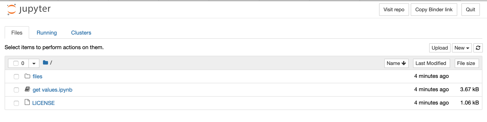

# SR_get-values

to get certain values from txt files

- There are many txt files.
- We want to get certain values from each file: 1) name and 2) value.
- In the ipynb file, I already set the process to get what we need from the txt. The final result is a Python dictionary: {"name": value}

## Steps

1. Start the server via 
2. 
3. Wait till the server is ready.

1. Upload txt files in to the `files` folder
  1. Click on the `files` folder
  1. On the up-right of the screen, click [Upload] Button to add all txt files.
  1. Wait till all files have been uploaded.
  2. 
1. Run the script in the `get values.ipynb`
  1. Go back to the main directory by clicking the folder icon around the up-left conor.
  1. Click on the `get values.ipynb` to open it
  1. Run all the cells by clicking on the tool bar: `Cell/Run all cee`
  1. The result should be found in the end of the file.
  2. 
